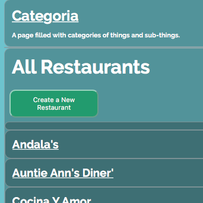

## Categoria : A Restaurants and Menus App



This is a catalog website that stores and displays restaurants, menus and menu items. It also permits adding and deleting entries. It was created for a Udacity project.

Static ip: `18.216.196.176`
Live site URL: <http://www.restaurantstuff.info>

## Requirements

- [VirtualBox](https://www.virtualbox.org/)
- [Vagrant](https://www.vagrantup.com/)
- [Python 3.5.2](https://www.python.org/downloads/release/python-352/)

## Quick Start

1. Download and place this application folder on your computer.
2. Download and install [VirtualBox](https://www.virtualbox.org/), this will run the virtual machine for this application.
3. Download and install [Vagrant](https://www.vagrantup.com/), A command line utility for management of virtual machines.
4. Download and install [Python 3.5.2](https://www.python.org/downloads/release/python-352/) To check to see if you already have Python installed as well as what version, in a command prompt type `python --version`.

Once everything is installed, using a command line interface (if youre on a mac you can use Terminal) navigate to the root application folder `~/restaurants_and_menus` and type `vagrant up`. This process may take a while, if you encounter any errors refer to [Vagrant's Troubleshooting Guide](https://www.vagrantup.com/docs/other/debugging.html).

Once the process is complete, type `vagrant ssh` and press `enter` you should then see something like
```
The shared directory is located at /vagrant
To access your shared files: cd /vagrant
```
Follow those instructions and navigate to `/vagrant` once inside the vagrant folder, you then need to navigate to `/my_restaurants_and_menus`.  Now, type `python project.py`and press `enter`

The application should now be running locally on your machine, you can access it using your web browser and going to the url `localhost:5000/`

## Configuration Notes

### Project Uses

Amazon Lightsail (Ubuntu Instance)
Deployed Python project with database server using PostgreSQL

### Customizations

Added new user: `grader`
Modified firewall ports for both the Ubuntu instance (sshd_config location: /etc/ssh) as well Lightsail GUI
  - Removed SSH Port 22
  - Added SSH Port 2200
  - Note, if restoring an instance, make sure to configure SSH Port 2200 via Lightsail GUI

Generated public/private keypair for `grader` access, stored private `.pem` file securely for SSH login
Created directory `.ssh`
Added file `authorized_keys`
Inserted public key-pair information in to `authorized_keys`
Installed `postgreSQL`
Installed Apache2
  - `sudo apt-get update`
  - `sudo apt-get install apache2`
  - Ensured Apache server is up and running on startup by editing /etc/ufw/ufw.conf file and adding `yes`

Register Python with Apache
 - `sudo mkdir /var/www/NewCategoria`
 - `sudo a2dismod mpm_event` (disable multithreading processes)
 - `sudo a2enmod mpm_prefork cgi` (Give Apache permission to run scripts)
 - `sudo nano /etc/apache2/sites-enabled/000-default.conf` (reconfigure apache to declare Python files as executable/allow executables)
 - Within `nano edit command` added:
  - <Directory /var/www/NewCategoria>
  -   Options +ExecCGI
  -   DirectoryIndex index.py
  - </Directory>
  - AddHandler cgi-script.py
  - ...
  - DocumentRoot /var/www/Categoria (modified)

Installing mod_wsgi
  - `sudo apt-get install libapache2-mod-wsgi`

Transferring app project data to Lightsail Instance
  - Using `git clone`, synced NewCategoria project folder to Lightsail instance.
